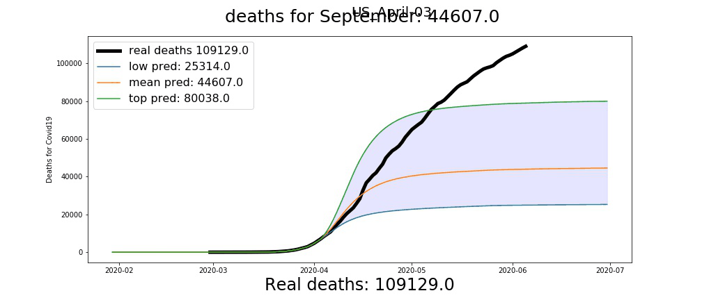

# Animations of contrasts for death prediction of Covid19
 This script and notebook produces mp4 animations, for contrasting real data of deaths for Covid19, with the predictions through time of [Youyang Gu](https://github.com/youyanggu/covid19_projections). It works for several countries.

 

Data come from [Youyang Gu repository](https://github.com/youyanggu/covid19_projections).

## Requeriments
* python 3.7
* pandas
* numpy
* matplotlib
* imageio
## Instructions
Download the repository.

You'll need the **'projections'** folder that's on the [Youyang Gu repository](https://github.com/youyanggu/covid19_projections).  

 
Place it on the same folder as [prediction_animation.py](prediction_animation.py) and [Contrasts animations for Deaths predictions of Covid19.ipynb](https://github.com/mesielepush/Animations-of-Contrast-for-death-predictions-of-Covid19/blob/master/Contrasts%20animations%20for%20Deaths%20predictions%20%20of%20Covid19.ipynb):  

Then you can run it from the console by typing: ` python prediction_animation.py country_name ` replacling country_name with the name of the country to animate.

Otherwise you can open jupyter notebook and open the notebook so you'll be able to modify the plots.

### Warning:
I faced the next problem when running from console:

**Error “could not find or load the Qt platform plugin windows” **

I solved it by following a response from [here](https://stackoverflow.com/questions/41994485/error-could-not-find-or-load-the-qt-platform-plugin-windows-while-using-matplo), by setting the `Library\plugins` Anaconda folder as `QT_PLUGIN_PATH` on the environment variables.

Running trough Jupyter notebook has no problems.